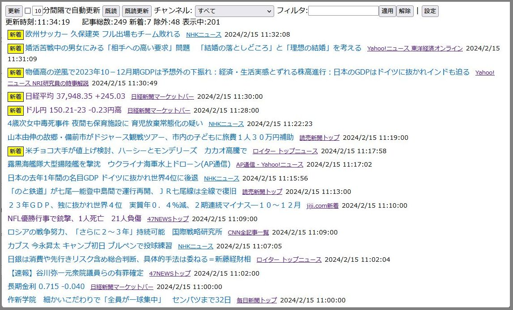
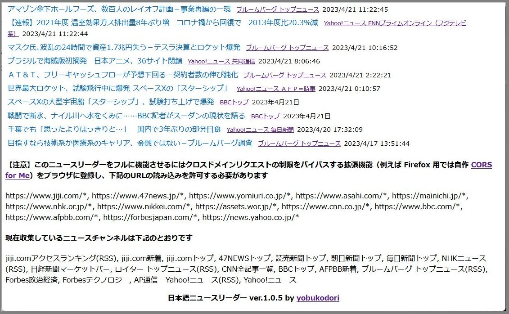
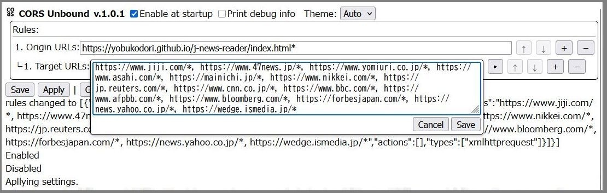
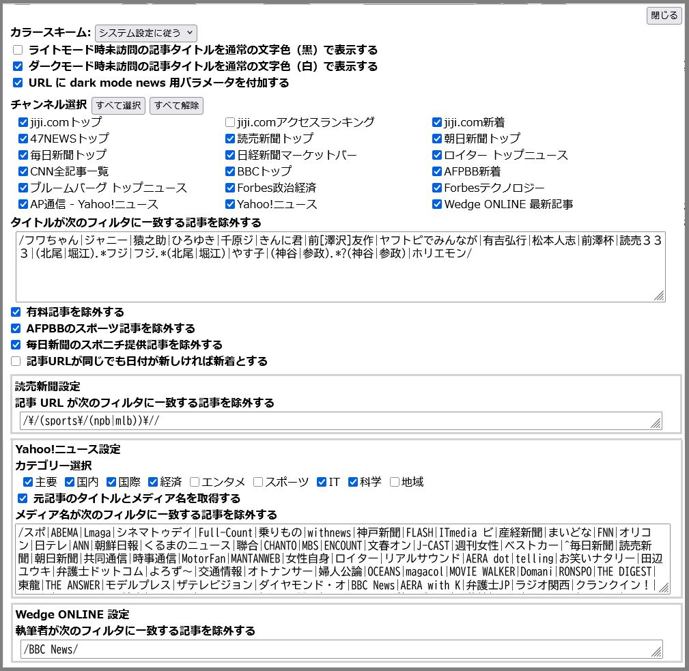

# 日本語ニュースリーダー

日本語ニュースを掲載しているサイトやRSSから記事を収集してリンク付きでタイトルを表示します。  
日付が新しい順に表示、新着はアイコン付きで表示  



## 【動作条件】

 - ブラウザにクロスドメインのリクエストを可能にするCORS操作拡張機能を入れてください。  
＊私はFirefoxに自作 [CORS&#32;Unbound](https://addons.mozilla.org/ja/firefox/addon/cors-unbound/) を入れて使用しています
- ニュースリーダー (index.html) をロードした時ページ下部に表示されるURLに対するクロスドメインリクエストを許可してください。



   
   【CORS Unbound での設定例】  
 


j-news-reader をローカルで実行する場合は Origin URLs にローカルの URL を追加してください。  
```
https://yobukodori.github.io/j-news-reader/index.html*, file:///C:/your/folder/j-news-reader/index.html*
```
末尾の`*`は`index.html?m`をカバーするために付けています。  

## 使い方

ページ (index.html) をロードすると自動的にニュースの読み込みを始めて結果を表示します。 ロード時に自動読み込みしたくない場合はURLのクエリに m を指定してください`.../index.html?m`  
すべてのファイルをローカルに置いて使用することもできますし、こちら (https://yobukodori.github.io/j-news-reader/index.html) を利用することもできます。

- **更新**：記事情報を読み込み新着記事を追加します。新着は背景色を変えています
- **[ ]分間隔で自動更新**：指定された間隔で自動的に更新します
- **既読**：新着記事から新着属性を除去します
- **既読更新**：新着属性を除去して更新します
- **チャンネル**：ソースを指定します。**新着**も指定できます
- **フィルタ**：フィルタを指定して記事を絞り込みます  
	フィルタには単純な字句または正規表現が使えます。 
    AND/OR/NOT演算ができます  
	- AND演算：字句を空白で区切る。例 `コロナ 中国`
	- OR演算：字句を or で区切る。例 `ロシア or プーチン` これは`/ロシア|プーチン/`とも書けます
	- NOT演算：字句の前に - を付ける。例 `-🔒` 有料／会員専用記事を除外します
	- ( ) でくくって演算の優先順位を指定できます 例 `(ウクラ or ゼレ) (ロシア or プー)`
	- **適用**：フィルタを適用し一致する記事だけ表示します。入力ボックス内で［Enter］でも適用
	- **解除**：フィルタの効果を解除します。入力ボックス内で［Esc］でも解除
- **設定**：各種設定ができます。次のスクリーンショットを参照してください。  



## ダークモードについて

日本語ニュースリーダー自体はダークモードに対応しますが各ニュースサイトは対応していません。記事もダークモードで表示したい場合は自作ユーザースクリプト [dark mode news](https://github.com/yobukodori/dark-mode-news) をインストールしてください。

## 収集しているニュースチャンネル

ページ (index.html) をロードすると下部に表示されます。
